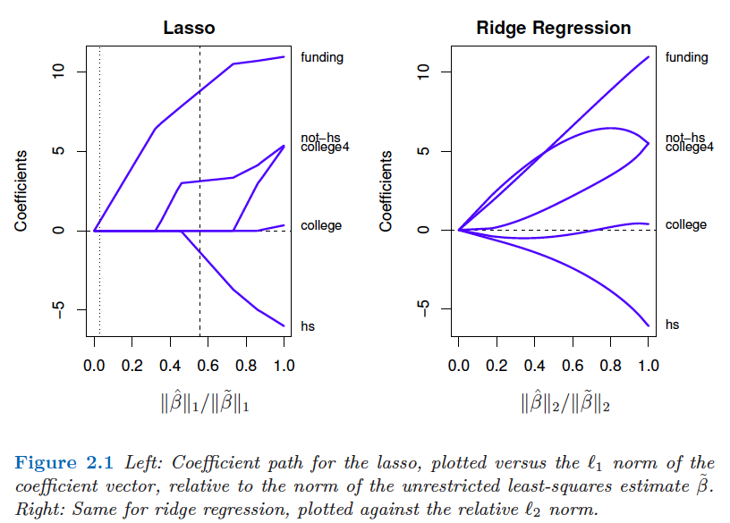
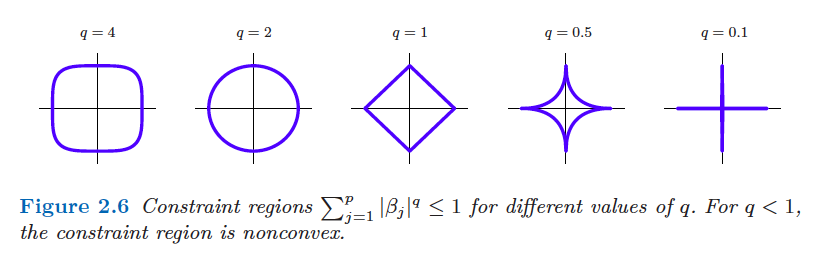
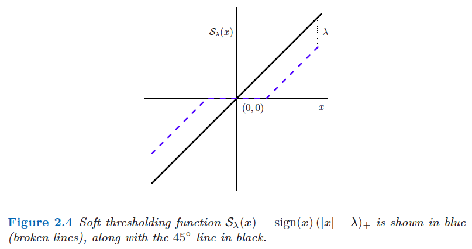
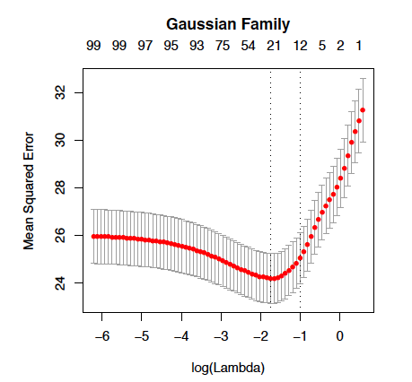

```{r setup, include=FALSE}
knitr::opts_chunk$set(echo = TRUE)
```


# Introduction

* **WHAT is feature selection**?

    + **Definition from Wikipedia**: 
    
    In machine learning and statistics, feature selection, also known as variable selection, attribute selection or variable subset selection, is the process of selecting a subset of relevant features (variables, predictors) for use in model construction. 

    + **My understanding**: 
    
    Feature selection is the process of selecting a subset of features from a large pool of features (or from all features you considered). More generally, it relates to sparse learning problems.

* **WHY do we need feature selection**?

    + **Curse of dimensionality**
    
        - Overfitting
        - Not well-defined OLS
        - Computation
    
    + **Model interpretability**
    
        Including too many variables makes the statistical/ machine learning model hard to interpret.
    
    + **Irrelevant or redundant features**
    
        Some variables have no relation with the problem. Some variables may carry the same information. 


* **WHEN do we need feature selection**?

    + High-dimensional cases (number of features p > sample size n)
    + Seek for interpretable models
    + Target for important features

* **HOW do we conduct feature selection**?
   
    Approaches to feature selection should be selected based on the problem you are working on. Is it a unsuperized learning or superized learning problem? Is it a regression problem or classification problem? Furthermore, what type of data are involved in your problem (particularly the outcome)? 
Let's first see a (incomplete) list of available methods.
    
    + Linear models 
    + Generalized linear models
    + Survival analysis models
    + Tree models 
    + Boosting methods


    In this tutorial, we will focus on linear regression models (superised learning, regression, continuous outcomes), including wrapper methods and penalization methods. Those two type of methods can also be applied to the other models. which we will go through in the following tutorials.

# Wrapper methods

Wrapper methods, also known as subset selection in statistics, refer to a family of supervised feature selection methods. Given a subset size $k$, wrapper methods seek the best model under some criterion. 

## Best-subset selection

Suppose the number of considered features is $p$, and the sample size is $n$.  For each $k \in \{1, 2, \cdots, p\}$, best-subset regression finds the subset of size $k$ that gives the smallest residual sum of squares. So in total, $2^p$ regression models are considered in the procedure.

* Large computational needs.

    Best-subset selection can only be feasible for $p$ as large as $40$.

* Selection of the subset size $k$

    The residual sum of squares decrease as $k$ increases. A number of criterion for determining $k$.


## Forward-stepwise selection

Rather than searching through all possible subsets, one can seek a good path through them.  Starting with the intercept, forward-stepwise selection sequentially adds into the model the predictor variable that most improves the fit.

* Computationally tractable (even with $p \gg n$)

* The subset size $k$ needs to be determined.

## Backward-stepwise selection

Backward-stepwise selection starts with the full model (all predictors are included), and sequentially
deletes the predictor that has the least impact on the fit. Backward
selection can only be used when $n>p$.

Some software packages implement hybrid stepwise-selection, namely considering both forward and backward moves at each step, and select the “best” of the two. A useful link below gives illustration on how to use the `olsrr` package to conduct subset selection and how to select $k$ using the AIC criterion.

<https://cran.r-project.org/web/packages/olsrr/vignettes/variable_selection.html>

# Penalization methods

Penalization methods, also known as shrinkage methods or regularization methods, are very popular tools for feature selection in statistics, machine learning, deep learning, and signal processing. We will see later that generalzied linear models, tree mdoels, and boosting methods all use penalization to conduct feature selection during their model construction.

## A flagship example -- Lasso

Let's consider a regression problem where we observe $n$ observations
of an outcome variable $y_i$ and $p$ associated predictor variables (or
features) $\boldsymbol x_i = (x_{i1}, \cdots, x_{ip})^T$. The goal here is to predict the outcome variable and to discover which predictors are important to the prediction. The linear regression model is given by

$$y_i = \beta_0 + \sum_{i=1}^p x_{ij}\beta_j + e_i,$$
where $\boldsymbol \beta = (\beta_0, \beta_1, \cdots, \beta_p)^T$ is the unknown vector of coefficents, and $e_i$ is an error term. The least squares estimation seeks an estimate of $\boldsymbol \beta$ by minimizing a squared loss

\begin{equation}
\tag{3.1}
\min_{\boldsymbol \beta \in R^p} \frac{1}{2n}\sum_{i=1}^n (y_i - \beta_0 - \sum_{i=1}^p x_{ij}\beta_j)^2
\end{equation}

**Issues with the least-squares estimate**

* Typically all estimated coefficients from (3.1) are nonzero, making the final model lose its interpretation if $p$ is large.

* The least-squares estimates are not unique when $n<p$. There is an infinite set of
solutions that make the objective function equal to zero, and these solutions
almost surely overfit the data as well.

**The Lasso (least absolute shrinkage and selection operator) method**

The Lasso method adds a constraint to the least-squares estimate to regularize the estimation process. Speficically, Lasso solves the following optimization problem

\begin{equation}
\tag{3.2}
\min_{\boldsymbol \beta \in R^p}  \frac{1}{2n}\sum_{i=1}^n (y_i - \beta_0 - \sum_{i=1}^p x_{ij}\beta_j)^2 ~~\text{subject to}~~ \lVert \boldsymbol \beta \rVert_1 \leq t
\end{equation}

where $\lVert \boldsymbol \beta \rVert_1 =\sum_{j=1}^p |\beta_j|$ is the $l_1$ norm of $\boldsymbol \beta$, and $t$ is a user-speficied parameter. More commonly, we write the problem as 

\begin{equation}
\tag{3.3}
\min_{\boldsymbol \beta \in R^p}  \frac{1}{2n}\sum_{i=1}^n (y_i - \beta_0 - \sum_{i=1}^p x_{ij}\beta_j)^2+\lambda \lVert \boldsymbol \beta \rVert_1
\end{equation}

There is a one-to-one correspondence between the parameters $\lambda$ in (3.3) and $t$ in (3.2).

**Why do we use $l_1$ norm? Why not $l_2$ or other $l_q$ norm?**

* $l_1$ norm can promote sparsity.

    The $l_2$ norm (which corresponds to ridge regression) and any other $l_q$ norm with $q>1$ cannot produce sparse solutions. In other words, they can not conduct feature selection.
    
    <center>
    {width=50%}
    </center>
* $l_1$ norm is convex, which simplifies the computation.

    The $l_q$ norm with $q \leq 1$ can produce sparse solutions, but $q = 1$ is the smallest value that yields
a convex problem, which allows for scalable algorithms that can handle problems even millions of parameters.

<center>
   {width=50%}
   </center>

**How is the Lasso estimator computed? How does $\lambda$ relates to the penalization/sparsity?**

Roughly spearking, the Lasso estimator is computed through a soft-thresholding operator, which shrinks the estimates towards to zero (by a amount of $\lambda$). Therefore, $\lambda$ controls the penalization rates, or equivalently the sparsity level of the estimate.

<center>
 {width=50%}
 </center>

## More penalization methods

Lasso is not perfect and has some limitations (estimation bias and large false positive rate). There are many other alternatives to Lasso, including elastic net, SCAD, MCP, distance penalization, generalized minimax concave penalization. We will discuss these different methods in the following tutorials.

## Method selection

With many different penalization methods available, another problem arises. How do we choose an appropriate method for our specific problem? It requires a lot of practical considerations, plus an understanding of pros and cons of different methods. We will also discuss in the following tutorials. 

<!-- Practical consideration (correlation/linearity/computation) -->


# Practical considerations in penalization methods

## Standardization

* Typically, we standardize the predictors $\boldsymbol x_i$ so that each column is centered ($\frac{1}{n}\sum_{i=1}^n x_{ij} = 0$) and has unit variance ($\frac{1}{n}\sum_{i=1}^n x_{ij}^2 = 1$).

    Without standardization, the lasso solutions would depend on the units used to measure the predictors.
* We also center the outcomes $y_i$ such that $\frac{1}{n}\sum_{i=1}^n y_{i} = 0$.

    In this way, we can omit the intercept term $\beta_0$ in the Lasso optimization problem and write it in a more compact form
    
    \begin{equation}
\tag{3.4}
\min_{\boldsymbol \beta \in R^p}  \frac{1}{2n}\sum_{i=1}^n \lVert \boldsymbol y - \boldsymbol X \boldsymbol \beta \lVert_2^2 +\lambda \lVert \boldsymbol \beta \rVert_1
\end{equation}

* Standardization is typically a default step in some software packages, for instance `glmnet`. You do not need to write your own code for standardization.

* Standardization is also required in other machine learning technoiques, such as SVM, PCA, clustering, etc.

## Model selection 

A practical question for feature selection is: how many features should be selected into the model. This corresponds to how to select the tuning parameter $\lambda$ in the Lasso methods since as we have discussed $\lambda$ controls the sparsity of the estimated coefficients.

There are many different ways to select the number of features:

* **Prior knowledge**

    You have some prior knowledge of how many features are appropriate for your problem. Or, you only want to include a prespecified number of features in your model. This is not uncommon. In fact, in this case, Lasso might not be the best choice since we do not have the explicit relation between the tuning parameter $\lambda$  and the number of selected features $k$. I will introduce an alternative to lasso later, which is an ideal method in this case.

* **Probabilistic Model Selection**

    Models are scored based on their performance on the training dataset and on the complexity of the model. Model performance is typically evaluated using a probabilistic framework, such as log-likelihood under the framework of maximum likelihood estimation. Model complexity is typically evaluated as the number of degrees of freedom or parameters in the model.

    + Akaike Information Criterion (AIC)
    
        $$AIC = 2k - 2ln (\hat{L})$$
        where $\hat L$ is the likelihood of the model on the training set, and $k$ is the number of parameters (features) in the model.
    
    + Bayesian Information Criterion (BIC)
    
        Like AIC, BIC is another criterion for selecting models fit under the maximum likelihood estimation framework.
    $$BIC = kln(n) - 2ln (\hat{L})$$
        where $\hat{L}$ is the likelihood of the model on the training set, $n$ is the sample size, and $k$ is the number of parameters (features) in the model.

* **Cross-Validation**
    + K-fold cross-validation
        
        Suppose we want to choose a tuning parameter $\lambda$ from a candidate set $\{\lambda_1, \lambda_2, \cdots, \lambda_m\}$. The K-fold cross-validation procedure goes as follows:
        
         1) Randomly split the full dataset into $K$ roughly equal-sized groups ($K=5, 10$, or $n$(leave-one-out cross-validation))
         2) For each unique group
             * Set the group as a test set
             * Use the remaining $K-1$ groups as the training set
             * Apply the model to the training set for each $\lambda_j$
             * Calculate the mean squared prediction error of each model on the test set
         3) Step 2) is repeated for $K$ times, so that each group is used exactly once as the test set. We obtain $K$ estimates of the prediction error for each $\lambda_j$ and select the one with the minimum average prediction error.
         
    + 1-standard error rule
    
        In practice, cross-validation tends to select a smaller $\lambda$, thus the resulting model is denser than expected. A common modification is using the following 1-SE rule (choose the largest value of lambda such that the error is within one standard-error of the minimum).
        
        <center>
         {width=50%}
        </center>

## Model assessment 

**Q**: After obtaining a fitted model, how can we evalute the model? Does it perform well? 

**A**: We need validation data to check the performance of the model using some metrics.

For instance, if we are dealing with a regression problem, we can compute the mean squared prediction error on a validation data set.
$$MSE = \frac{1}{n} \sum(\boldsymbol y_{true} - y_{pred})^2$$


**References** 

1. Hastie, T., Tibshirani, R., & Wainwright, M. (2015). Statistical learning with sparsity. Monographs on statistics and applied probability, 143, 143.
2. Hastie, T., Tibshirani, R., Friedman, J. H., & Friedman, J. H. (2009). The elements of statistical learning: data mining, inference, and prediction (Vol. 2, pp. 1-758). New York: springer.
3. Patrick Breheny's BIOS 7240 lecture notes <https://myweb.uiowa.edu/pbreheny/7240/s19/notes.html>
4. Friedman, J., Hastie, T., & Tibshirani, R. (2010). Regularization paths for generalized linear models via coordinate descent. Journal of statistical software, 33(1), 1.
4. <https://machinelearningmastery.com/probabilistic-model-selection-measures/>

<!-- <https://neptune.ai/blog/feature-selection-methods> -->

<!--  <https://cran.r-project.org/web/packages/olsrr/index.html> -->

<!--  <https://towardsdatascience.com/a-guide-to-model-selection-for-survival-analysis-2500b211c733> -->

