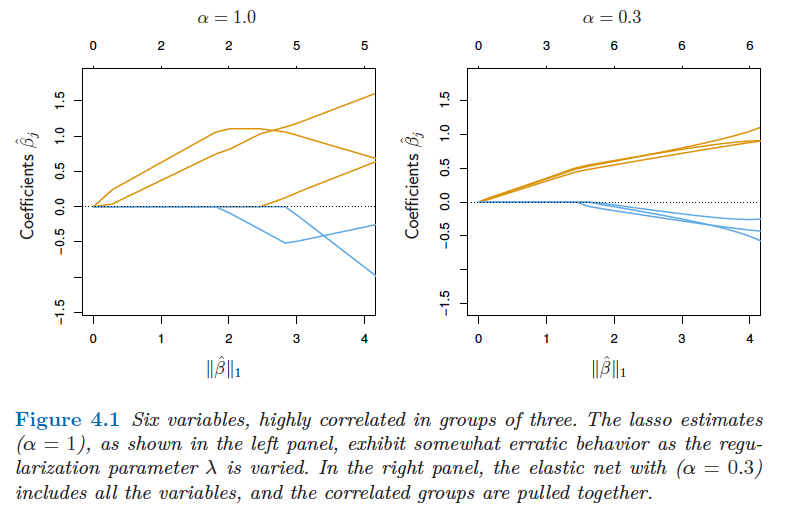
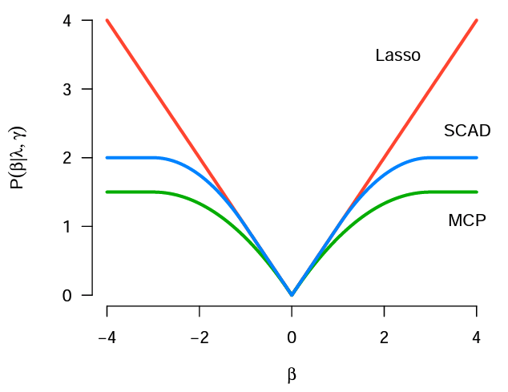
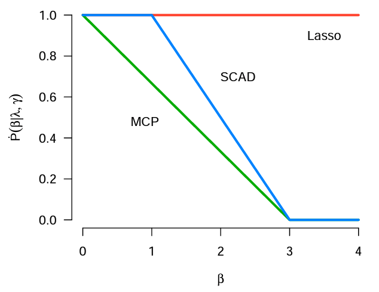
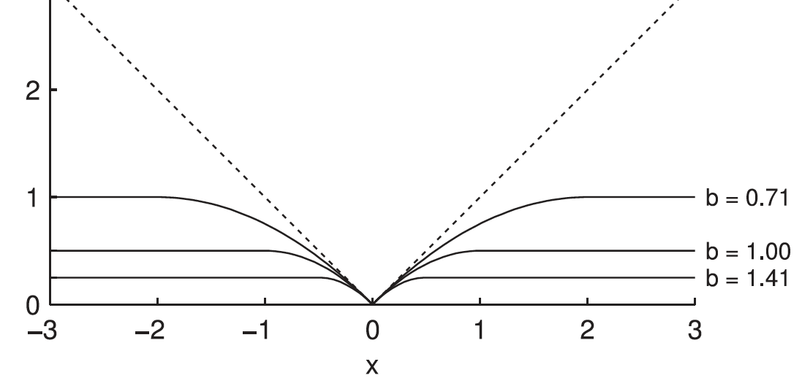
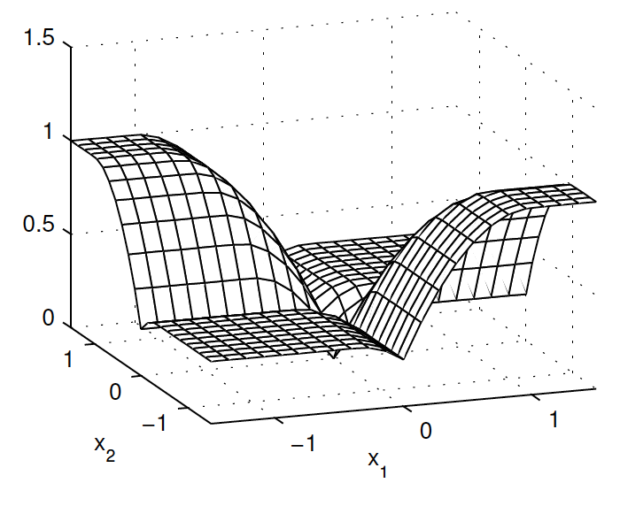

```{r setup, include=FALSE}
knitr::opts_chunk$set(echo = TRUE)
```


# Introduction

In our first stats/ML tutorial, we discussed feature selection methods in linear regression. We talked about wrapper methods (best-subset selection, forward-stepwise selection, and backward-stepwise selection), penalization methods (the flagship example Lasso), and some practical considerations in penalization methods.  

    
In this tutorial, we will discuss more on penalization methods. Penalization methods, also known as regularization methods, are very popular tools for feature/variable selection in statistics, machine learning and signal processing. 
However, its application is not restricted to feature selection. Generally speaking, it is applicable to constrained optimization problems. 
In this tutorial, we will introduce and compare four commonly used penalty functions and two new penalty functions in the context of linear regression. The goal of this tutorial is to give a brief introduction of different penalization methods and provide a list of tools for people to choose based on the practical need. 


# Commonly-used penalization methods

We first introduce some penalization methods that are very commonly-used in statistics and machine learning. Their immplementations are readily available in some R pacakges. 

## Review of Lasso

We consider a regression problem 
\begin{equation}
\tag{2.1}
\boldsymbol y = \boldsymbol X \boldsymbol \beta + \boldsymbol \epsilon, 
\end{equation}

where $\boldsymbol y \in R^{n}$ is the vector of responses, $\boldsymbol X \in R^{n \times p}$ is the design matrix containing $p$ covariate variables $\boldsymbol x_1, \dots, \boldsymbol x_p$.  $\boldsymbol \beta = (\beta_1, \cdots, \beta_p)^T$ is the unknown vector of coefficents, and $\boldsymbol \epsilon$ is an error term. The Lasso (least absolute shrinkage and selection operator) method solves the following optimization problem


\begin{equation}
\tag{2.2}
\min_{\boldsymbol \beta \in R^p}  \frac{1}{2n}\lVert \boldsymbol y -\boldsymbol X \boldsymbol \beta \rVert_2^2+\lambda \lVert \boldsymbol \beta \rVert_1,
\end{equation}

where $\lambda \geq 0$ is the nonnegative regularization parameter, which controls the balance between the squared loss and the model complexity. The $l_1$ norm yields the sparse estimate of $\boldsymbol \beta$ (See why we use $l_1$ norm in the previous tutorial).


## Elastic Net

In real-word problems, we often encounter correlated covariate features. Empirically, Lasso does not perform well with highly correlated variables; the coefficient paths tend to be erratic and can sometimes show wild behavior. The elastic net penlaty does better with such situation and tends to select the correlated features (or not) together. The elastic net penalty is defined as 
\begin{equation}
\tag{2.3}
P_{\lambda}(\boldsymbol \beta) = \lambda ( \alpha \lVert \boldsymbol \beta \rVert_1 + \frac{1-\alpha}{2}\lVert \boldsymbol \beta \rVert_2^2),
\end{equation}
which is a combination of the $l_1$-penalty (Lasso) and the squared $l_2$-penalty (ridge) (Similarities and differences bwteen Lasso and ridge? See the previous tutorial).
When $\alpha=1$, the elastic net reduces to the Lasso penalty, and with $\alpha = 0$, it reduces to the squared $l_2$-norm, corresponding to the ridge penalty.

* An illustrative comparison of Lasso and elastic net on correlated features (adopte from the SLS book).
<center>
   {width=60%}
   </center>

Benefits of adding the ridge penalty to Lasso:

* Grouping effect: highly correlated features have similar estimated coefficients (often one of the strongest motivations for applying an elastic net penalty)

    The elastic net automatically controls for strong within-group correlations.

* Unique solution: inherits the ability of ridge regression to always produce a unique solution 

    The elastic net  penalized least squares problem is strictly convex  for $\alpha<1$ and $\lambda>0$.


## SCAD

Lasso and its variants are convex penalties and tend to underestimate large magnitude components of the coefficients. Alternatives to mitigate such estimation bias are folded concave penalties. One influential example is the smoothly clipped absolute deviations (SCAD) penalty:
\begin{equation}
\tag{2.4}
P_{\lambda}(|x|) = 
\begin{cases}
\lambda |x|,  ~~~~~~~~~~~~~~ \text{if}~ |x| \leq \lambda,\\
\frac{2\gamma \lambda |x| -x^2-\lambda^2}{2(\gamma-1)}, ~~ \text{if}~ \lambda < |x| < \gamma \lambda, \\
\frac{\lambda^2(\gamma+1)}{2}, ~~~~~~~~~ \text{if}~ |x| \geq \gamma \lambda,
\end{cases}
\end{equation}
for some $\gamma>2$. $\gamma=3.7$ is often used.

Structure of SCAD:

* Coinsides with Lasso when $|x|\leq \lambda$

* Trasitions to a quadratic function with $\lambda < |x| < \gamma \lambda$

* Remains as a constant for all $|x| \geq \gamma \lambda$

A penalty's derivative represents its penalization rate. For SCAD, its derivative is 

\begin{equation}
\tag{2.5}
P'_{\lambda}(|x|) = 
\begin{cases}
\lambda,  ~~~~~~~~~ \text{if}~ |x| \leq \lambda,\\
\frac{\gamma\lambda - |x|}{\gamma-1}, ~~ \text{if}~ \lambda < |x| < \gamma \lambda, \\
0, ~~~~~~~~ \text{if}~ |x| \geq \gamma \lambda.
\end{cases}
\end{equation}

Therefore, SCAD retains the penalization rate (estimation bias) of Lasso for small magnitude coefficients, and smoothly relaxes the rate as the magtitude of coefficients increases. 


## MCP

The MCP (minimax concave penalty) is another example of folded concave penalty. It is given by

\begin{equation}
\tag{2.6}
P_{\lambda}(|x|) = 
\begin{cases}
\lambda |x| - \frac{x^2}{2\gamma},  ~~~ \text{if}~ |x| \leq \gamma \lambda,\\
\frac{1}{2}\gamma\lambda^2, ~~~~~~~~~ \text{if}~ |x| > \gamma \lambda,
\end{cases}
\end{equation}

for some $\gamma>1$. $\gamma=3$ is often used. And its derivative is 

\begin{equation}
\tag{2.7}
P_{\lambda}(|x|) = 
\begin{cases}
\lambda  - \frac{|x|}{\gamma},  ~~~ \text{if}~ |x| \leq \gamma \lambda,\\
0, ~~~~~~~~~~~ \text{if}~ |x| > \gamma \lambda.
\end{cases}
\end{equation}

From the derivative, we see that MCP starts with the same penalization rate as Lasso (at $|x|=0$), and then quickly relaxes it down to zero as the magnitude of coefficients increases. 

* Visualization of Lasso, SCAD, MCP and their derivatives (from Patrick Breheny’s
lecture on BIOS 7240).

<center>
   {width=40%} {width=40%}
   </center>


# Two new penalization methods

## GMC

If we categorize penalty functions based on the convexity of the penalized least squres problem, we have

* convex penalization: Lasso and its variants

    Convex penalization methods use convex penalty functions and deal with a convex optimization problem, which has no sub-optimal minimizers. But convex penalization tends to under-estimate large magnitude coefficients.


* nonconvex penalization: SCAD and MCP
    
    Non-convex penalization methods employ folded convave penalty functions, which can mitigate the estimation bias as we discussed above. But with a nonconvex penalty, the penalized least squares problem is not guaranteed to be convex. It is often that the problem has multiple local minimizers, which are not global minimizers. Algorithms for solving such problem can be trapped in local minimizers. 

A new penalization strategy called convex-nonconvex (CNC) penalization was studied in the field of signal processing. The motivation is to design a nonconvex penalty function but maintain the convexity of the optimization problem, so that one can enjoy the benefits of convex and nonconvex penalization simultaneously. 


A prominent example is called generalized minimax conxave (GMC) penalty proposed in 2017, which is given in the following form:
\begin{equation}
\tag{3.1}
P(\boldsymbol \beta) = \lVert \boldsymbol \beta \rVert_1 - \min_{\boldsymbol v} \{\lVert \boldsymbol v \rVert_1+ \frac{1}{2}\lVert \boldsymbol B (\boldsymbol \beta - \boldsymbol v) \rVert_2^2 \},
\end{equation}
which is the $l_1$ norm minus its generalized infimal convolution. Both functions are convex, and the resulting GMC penalty is typically nonconvex. 

* Visualization of GMC in the univariate case (left) and multivariate case (right), adopted from Selesnick, 2017. 

<center>
   {width=40%} {width=40%}
   </center>
   
* Commentery on GMC   
    - Also a folded concave penalty.
      
    - Matrix parameter B=0, GMC reduces back to Lasso (which is convex).
      
    - Matrix parameter B is diagonal and the diagonal elements are suitably designed, GMC is equivalent to MCP.
      
    - The non-separability of GMC makes it possible to maintain the convexity of the optimization problem even in the high-dimensional case. 
      
    - The nonconvexity of the GMC penalty leads to estimation even more accurate than MCP.
      
    - The drawback of GMC is its computation and limited generalization to GLM and other sparsity learning scenarios. 
      
  

## Distance penalization
 
 
Let us consider a very general setting
\begin{equation}
\tag{3.2}
\min_{\boldsymbol \beta} ~l(\boldsymbol \beta) ~~~~\text{for} ~~ \boldsymbol \beta \in C,
\end{equation}
where $l(\boldsymbol \beta)$ is the loss function, and $C$ is the constraint set that specifies the required structure on $\boldsymbol \beta$. In the conext of sparse linear regression, $l(\boldsymbol \beta)= \frac{1}{2n}\lVert \boldsymbol y -\boldsymbol X \boldsymbol \beta \rVert_2^2$ and $C = \{\boldsymbol \beta: \lVert \boldsymbol \beta \lVert_0 \leq k\}$ with $k$ an positive iteger controlling the sparsity of $\boldsymbol \beta$. If we set $C = \{\boldsymbol \beta: \lVert \boldsymbol \beta \lVert_1 \leq k\}$, the problem goes back to the Lasso penalized least squares problem.


Though problem (3.2) is a straightforward way to formulate the structure of $\boldsymbol \beta$, it is a constrained optimization problem and typically hard to deal with. Distance penalty function quantifies the distance between $\boldsymbol \beta$ and the constraint set $C$, and is defined as 

\begin{equation}
\tag{3.3}
\phi (\boldsymbol \beta) = \frac{1}{2} \text{dist}(\boldsymbol \beta, C)^2 = \min_{\boldsymbol u \in C} \frac{1}{2} \lVert \boldsymbol \beta - \boldsymbol u\rVert_2^2.
\end{equation}
Therefore, the resulting optimization problem is
\begin{equation}
\tag{3.4}
\min_{\boldsymbol \beta} ~l(\boldsymbol \beta) + \frac{\rho}{2} \text{dist}(\boldsymbol \beta, C)^2.
\end{equation}
* When $\rho \to \infty$, $\boldsymbol \beta \in C$ (recovers the constrained solution)

* $\rho$ is no longer a tuning parameter (assigned a large value in practice)

* The regularization parameter is contained in the definition of $C$

Advantages of distance penalization:

* A general definition

    - diverse structures: sparsity, order constraint, shape constraint, box constraint, rank constraint
   
    - multiple constraints: $\frac{1}{2}\sum_{i=1}^I w_i \text{dist}(\boldsymbol \beta, C_i)^2$ 
   
    - fusion constraint: $\boldsymbol  L \boldsymbol \beta \in C$ \citep{fused-dist}
   
   
* Practical meaning of the regularization parameter

    - $k$ = number of nonzeros in $\boldsymbol \beta$ for the sparsity constraint (particularly useful in practical applications)

   
* Only projection onto the constraint set is necessary

    - no requirement that $\ell$ or $C$ is convex
    - no requirement that $\ell$ is differentiable

* An efficient proximal distance algorithm
    - $\text{dist}(\boldsymbol \beta, C)^2 \leq \lVert \boldsymbol \beta - \mathcal{P}_C(\boldsymbol \beta_0) \lVert_2^2$ for $\forall \boldsymbol \beta_0$


Distance penalization has been applied to linear regression, generalized linear regression, support vector machine, $\text{L}_2$E regression, and many others. Please see the reference below for more details. 


# Discussion

We discussed a bunch of penalization methods that are commonly used or newly proposed in statistics, machine learning and signal processing. However, there are many other penalization methods that we did not cover in this tutorial. For instance, adaptive Lasso, group Lasso, group SCAD/MCP, group GMC and so on. The rich set of penalization methods provides powerful tools for people to deal with feature selection and structured data analysis under various scenarios. It is important to learn about the advantages and disadvantages of each method, so that one can make an informed decision which one is the best choice under the specific scenario. 


**References** 

1. Hastie, T., Tibshirani, R., & Wainwright, M. (2015). Statistical learning with sparsity. Monographs on statistics and applied probability, 143, 143.
2. Zou, H., & Hastie, T. (2005). Regularization and variable selection via the elastic net. Journal of the royal statistical society: series B (statistical methodology), 67(2), 301-320.
3. Fan, J., & Li, R. (2001). Variable selection via nonconcave penalized likelihood and its oracle properties. Journal of the American statistical Association, 96(456), 1348-1360.
4. Zhang, C. H. (2010). Nearly unbiased variable selection under minimax concave penalty.
5. Patrick Breheny's BIOS 7240 lecture notes <https://myweb.uiowa.edu/pbreheny/7240/s19/notes.html>
6. Selesnick, I. (2017). Sparse regularization via convex analysis. IEEE Transactions on Signal Processing, 65(17), 4481-4494.
7. Huang, J., Breheny, P., & Ma, S. (2012). A selective review of group selection in high-dimensional models.
8. Liu, X., Molstad, A. J., & Chi, E. C. (2021). A convex-nonconvex strategy for grouped variable selection. arXiv preprint arXiv:2111.15075.
9. Chi, E. C., Zhou, H., & Lange, K. (2014). Distance majorization and its applications. Mathematical programming, 146, 409-436.
10. Xu, J., Chi, E., & Lange, K. (2017). Generalized linear model regression under distance-to-set penalties. Advances in Neural Information Processing Systems, 30.
11. Landeros, A., & Lange, K. (2022). Algorithms for sparse support vector machines. Journal of Computational and Graphical Statistics, 1-12.
12. Liu, X., Chi, E. C., & Lange, K. (2022). A Sharper Computational Tool for Regression. Technometrics, 1-10.


<!-- <https://neptune.ai/blog/feature-selection-methods> -->

<!--  <https://cran.r-project.org/web/packages/olsrr/index.html> -->

<!--  <https://towardsdatascience.com/a-guide-to-model-selection-for-survival-analysis-2500b211c733> -->

